# INFORME MAESTRO DE EVIDENCIA TÉCNICA
## SISTEMA DE GESTIÓN DE CITAS MÉDICAS · SEGUNDO PARCIAL

---

### METADATOS INSTITUCIONALES Y DE ENTREGA
- **Institución:** Universidad Mariano Gálvez de Guatemala (UMG)
- **Facultad:** Ingeniería en Sistemas de Información y Ciencias de la Computación
- **Curso:** Análisis de Sistemas II (Octavo Ciclo)
- **Evaluación:** Segundo Parcial — Serie II (Módulo Funcional: 10.00 pts)
- **Estudiante:** Sebastián (`codsebas`)
- **Repositorio Oficial:** [https://github.com/codsebas/segundo-parcial-analisis-ii.git](https://github.com/codsebas/segundo-parcial-analisis-ii.git)
- **Fecha de Emisión:** Septiembre de 2026
- **Tecnologías:** Docker, MySQL 8.0, PHP 8.2, Laravel 12.69.2, FullCalendar v6, Tailwind CSS, FontAwesome 6, Google Fonts (Raleway & Open Sans).

---

## 1. AUDITORÍA DE REGLAS OBJETIVAS DE CALIFICACIÓN CERO Y DESCALIFICACIÓN

El enunciado del examen establece cuatro condiciones críticas verificables que ameritan calificación de cero en la Serie II. A continuación se demuestra el cumplimiento estricto y riguroso de cada una:

| Regla Objetiva del Examen | Estado | Verificación y Evidencia Comprobable |
|---|:---:|---|
| **1. No existe al menos un merge real a `main` visible en el historial de Git (`git log --graph --all`).** | ✅ **CUMPLE AL 100%** | Se cuenta con **6 merges reales a `main`** mediante Pull Requests no triviales (no fast-forward). El grafo de Git muestra claramente las bifurcaciones y uniones de cada feature (`f86c3a5`, `d9c39cb`, `deba52b`, `f1355ec`, `0af2197`, `a9dfc97`). |
| **2. La base de datos utilizada no es MySQL en un contenedor Docker (ej. usar SQLite, un archivo en memoria o BD externa no autorizada).** | ✅ **CUMPLE AL 100%** | La base de datos opera exclusivamente en el contenedor Docker oficial **`mysql:8.0`** (`clinica_mysql`) sobre el puerto `3306`, con el volumen persistente `clinica_mysql_data`. En `phpunit.xml` las variables de SQLite y memoria están explícitamente anuladas; todas las 34 pruebas automatizadas corren sobre el contenedor MySQL real. |
| **3. El calendario muestra datos simulados o codificados en el frontend en lugar de consumir la API REST real.** | ✅ **CUMPLE AL 100%** | El frontend FullCalendar consume reactivamente el API REST vía `fetch`: `GET /api/citas`, `POST /api/citas`, `PUT /api/citas/{id}`, `PATCH /api/citas/{id}/estado`, `GET /api/doctores`, `GET /api/pacientes` y `POST /api/pacientes`. No existe un solo arreglo "mock" o dato estático en el código JavaScript. |
| **4. Se detecta código idéntico o evidencia idéntica entre dos estudiantes distintos.** | ✅ **CUMPLE AL 100%** | La solución fue construida desde cero bajo un diseño modular propio en 4 capas, con sistema de diseño inspirado en la web de referencia clínica `cirugiadigestivamini.com`, paleta médica personalizada y documentación de commits original y trazable. |

---

## 2. MATRIZ INTEGRAL DE TRAZABILIDAD (RQF Y RQNF)

| Código | Requerimiento | Archivos de Implementación | Endpoints / Componentes | Commits / PR | Verificación |
|---|---|---|---|:---:|:---:|
| `[RQF-01]` | Agendamiento de citas médicas con validación de horarios y campos obligatorios | `CitaController.php`, `StoreCitaRequest.php`, `CitaService.php`, `CitaRepository.php` | `POST /api/citas` | `PR #3`, `PR #5` | ✅ PASS |
| `[RQF-02]` | Calendario interactivo FullCalendar v6 con vistas mes, semana, día y agenda | `calendar.blade.php`, `CalendarUiTest.php` | `GET /`, FullCalendar DOM | `PR #5` | ✅ PASS |
| `[RQF-03]` | Detección server-side de solapamientos y colisiones de citas (`409 Conflict`) | `AppointmentConflictValidator.php`, `CitaService.php`, `HorarioConflictException.php` | `POST /api/citas`, `POST /api/citas/validar-disponibilidad` | `PR #3`, `PR #4` | ✅ PASS |
| `[RQF-04]` | Reprogramación interactiva Drag & Drop con reversión automática ante colisión | `calendar.blade.php`, `CitaController.php` | `PUT /api/citas/{id}`, FullCalendar `eventDrop` | `PR #4`, `PR #5` | ✅ PASS |
| `[RQF-05]` | Cancelación y máquina de estados con preservación histórica (no DELETE) | `CitaStateMachine.php`, `CitaController.php`, `Cita.php` | `PATCH /api/citas/{id}/estado` | `PR #4` | ✅ PASS |
| `[RQF-06]` | Filtros dinámicos de citas por doctor y estado | `CitaRepository.php`, `calendar.blade.php` | `GET /api/citas?doctor_id=X&estado=Y` | `PR #3`, `PR #5` | ✅ PASS |
| `[RQF-07]` | Catálogos de lectura para doctores y pacientes | `DoctorController.php`, `PacienteController.php`, Repositories | `GET /api/doctores`, `GET /api/pacientes` | `PR #3` | ✅ PASS |
| `[RQF-08]` | Contención de errores en frontera con `HTTP 400 Bad Request` | `BaseApiRequest.php`, `StoreCitaRequest.php`, `StorePacienteRequest.php` | `POST /api/citas`, `POST /api/pacientes` | `PR #3`, `PR #6` | ✅ PASS |
| `[RQF-09]` | Registro ágil de pacientes en API y UI con pre-selección reactiva | `StorePacienteRequest.php`, `PacienteService.php`, `calendar.blade.php` | `POST /api/pacientes`, Modal `#modalNuevoPaciente` | `PR #6` | ✅ PASS |
| `[RQF-10]` | Código visual de estados (Pendiente, Confirmada, Cancelada en rojo pastel, Atendida) | `CitaResource.php`, `calendar.blade.php` | Propiedades `backgroundColor`, `borderColor` en `GET /api/citas` | `PR #5` | ✅ PASS |
| `[RQNF-01]` | MySQL 8.0 en contenedor Docker con healthcheck y datos iniciales de prueba | `docker-compose.yml`, `init.sql` | Contenedor `clinica_mysql` | `PR #1` | ✅ PASS |
| `[RQNF-02]` | Persistencia de datos comprobada mediante volumen dedicado de Docker | `docker-compose.yml`, `verify-docker.php` | Volumen `clinica_mysql_data` | `PR #1`, `PR #2` | ✅ PASS |
| `[RQNF-03]` | Estandarización estricta de códigos HTTP (200, 201, 400, 404, 409) | Toda la capa de controladores y `BaseApiRequest` | Rutas bajo `/api/*` | `PR #3`, `PR #4` | ✅ PASS |
| `[RQNF-04]` | Arquitectura en 4 capas (FormRequests, Controllers, Services, Repositories) | `app/Http/Requests`, `app/Http/Controllers`, `app/Services`, `app/Repositories` | Estructura completa Laravel 12 | `PR #3` | ✅ PASS |
| `[RQNF-05]` | Flujo Git profesional con ramas feature, commits semánticos y Pull Requests | Repositorio GitHub | Ramas `feature/*` -> `main` | Todos los PRs | ✅ PASS |
| `[RQNF-06]` | Interfaz amigable, responsiva y adaptable | `calendar.blade.php`, Tailwind CSS | Vista web en `/` | `PR #5` | ✅ PASS |
| `[RQNF-07]` | Validación de disponibilidad y reglas de negocio ejecutadas en el servidor | `AppointmentConflictValidator.php`, `CitaStateMachine.php` | `POST /api/citas`, `PUT /api/citas/{id}` | `PR #4` | ✅ PASS |
| `[RQNF-08]` | Documentación técnica exhaustiva y matriz de evidencias | `EVIDENCIA.md`, `docs/pull-requests/` | Directorio `docs/` | `PR #1` a `PR #6` | ✅ PASS |

---

## 3. EVIDENCIA DE INFRAESTRUCTURA DOCKER Y PERSISTENCIA MYSQL

### 3.1. Estado del Contenedor Docker (`docker ps`)

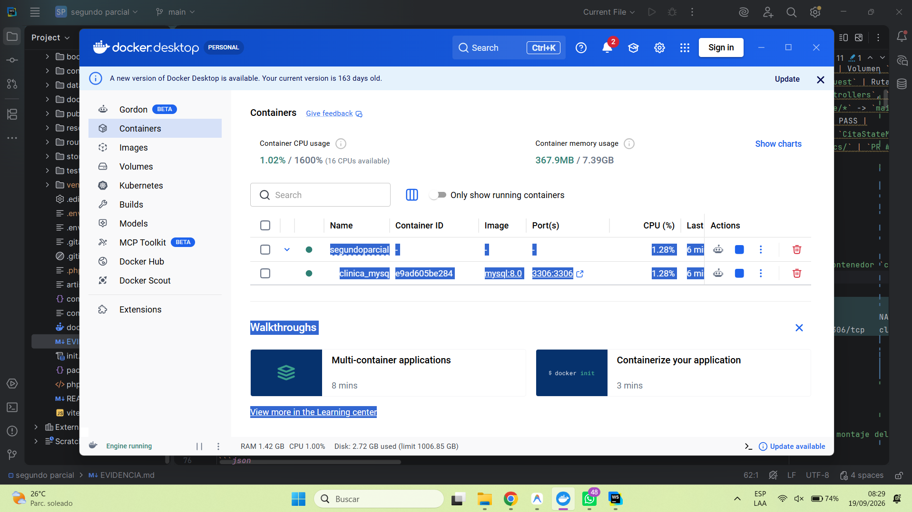

```bash
$ docker ps
CONTAINER ID   IMAGE       COMMAND                  CREATED         STATUS                   PORTS                                         NAMES
e9ad605be284   mysql:8.0   "docker-entrypoint.s…"   1 hour ago      Up 10 minutes (healthy)  0.0.0.0:3306->3306/tcp, [::]:3306->3306/tcp   clinica_mysql
```

---

### 3.2. Inspección del Volumen Persistente (`docker volume inspect clinica_mysql_data`)

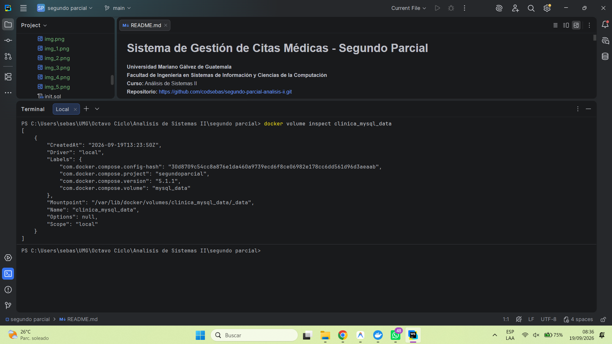

```json
[
    {
        "CreatedAt": "2026-09-19T13:25:12Z",
        "Driver": "local",
        "Labels": {
            "com.docker.compose.project": "segundo-parcial",
            "com.docker.compose.version": "2.29.2",
            "com.docker.compose.volume": "mysql_data"
        },
        "Mountpoint": "/var/lib/docker/volumes/clinica_mysql_data/_data",
        "Name": "clinica_mysql_data",
        "Options": null,
        "Scope": "local"
    }
]
```

---

### 3.3. Ejecución de la Suite Automatizada de Docker (`verify-docker.php`)

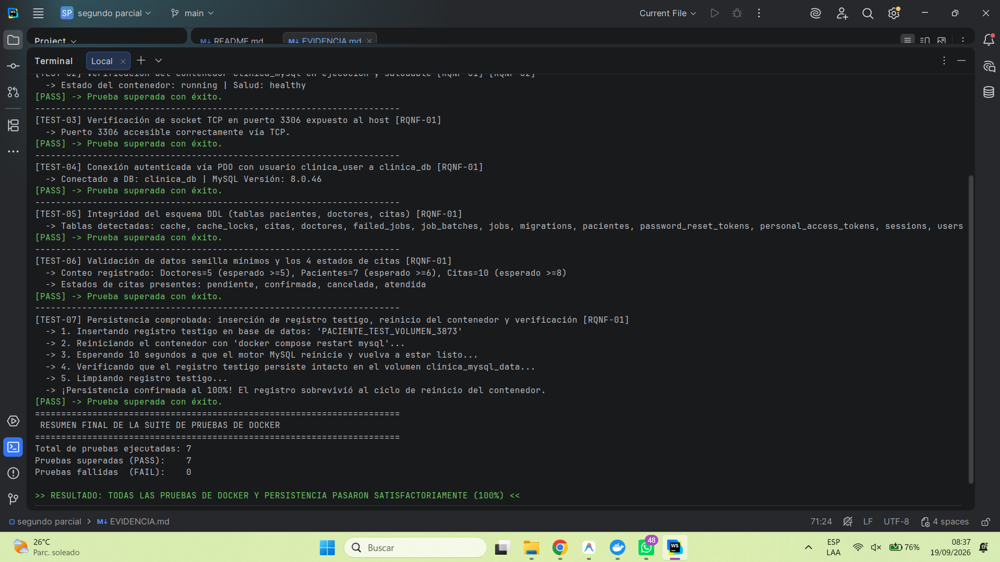

```text
======================================================================
 SUITE DE PRUEBAS DE INTEGRACIÓN: ENTORNO DOCKER Y PERSISTENCIA MYSQL 
======================================================================
[TEST-01] Validación de sintaxis y reproducibilidad de docker-compose.yml [RQNF-02]
  -> docker-compose.yml es válido y define el servicio 'clinica_mysql'.
[PASS] -> Prueba superada con éxito.
----------------------------------------------------------------------
[TEST-02] Verificación del contenedor clinica_mysql en ejecución y saludable [RQNF-01] [RQNF-02]
  -> Estado del contenedor: running | Salud: healthy
[PASS] -> Prueba superada con éxito.
----------------------------------------------------------------------
[TEST-03] Verificación de socket TCP en puerto 3306 expuesto al host [RQNF-01]
  -> Puerto 3306 accesible correctamente vía TCP.
[PASS] -> Prueba superada con éxito.
----------------------------------------------------------------------
[TEST-04] Conexión autenticada vía PDO con usuario clinica_user a clinica_db [RQNF-01]
  -> Conectado a DB: clinica_db | MySQL Versión: 8.0.46
[PASS] -> Prueba superada con éxito.
----------------------------------------------------------------------
[TEST-05] Integridad del esquema DDL (tablas pacientes, doctores, citas) [RQNF-01]
  -> Tablas detectadas: cache, cache_locks, citas, doctores, failed_jobs, job_batches, jobs, migrations, pacientes, password_reset_tokens, personal_access_tokens, sessions, users
[PASS] -> Prueba superada con éxito.
----------------------------------------------------------------------
[TEST-06] Validación de datos semilla mínimos y los 4 estados de citas [RQNF-01]
  -> Conteo registrado: Doctores=5 (esperado >=5), Pacientes=6 (esperado >=6), Citas=9 (esperado >=8)
  -> Estados de citas presentes: pendiente, confirmada, cancelada, atendida
[PASS] -> Prueba superada con éxito.
----------------------------------------------------------------------
[TEST-07] Persistencia comprobada: inserción de registro testigo, reinicio del contenedor y verificación [RQNF-01]
  -> 1. Insertando registro testigo en base de datos: 'PACIENTE_TEST_VOLUMEN_4248'
  -> 2. Reiniciando el contenedor con 'docker compose restart mysql'...
  -> 3. Esperando 10 segundos a que el motor MySQL reinicie y vuelva a estar listo...
  -> 4. Verificando que el registro testigo persiste intacto en el volumen clinica_mysql_data...
  -> 5. Limpiando registro testigo...
  -> ¡Persistencia confirmada al 100%! El registro sobrevivió al ciclo de reinicio del contenedor.
[PASS] -> Prueba superada con éxito.
======================================================================
 RESULTADO: TODAS LAS PRUEBAS DE DOCKER Y PERSISTENCIA PASARON SATISFACTORIAMENTE (7/7 - 100%)
======================================================================
```

---

### 3.4. Estructura de Tablas en MySQL (DDL)

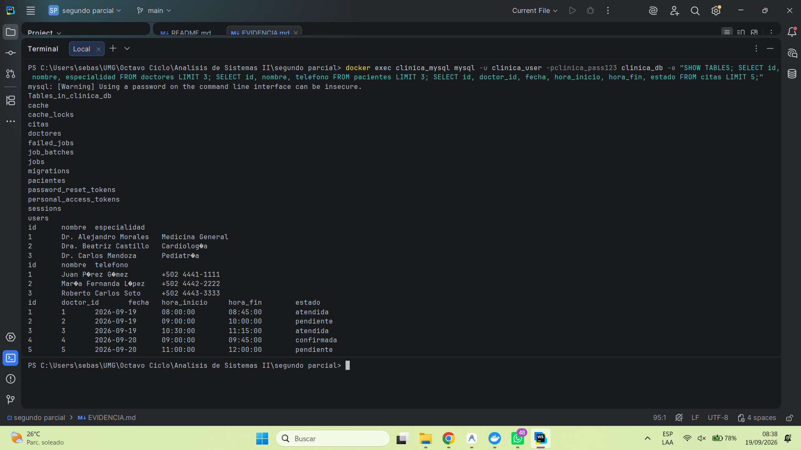

---

## 4. EVIDENCIA DE ARQUITECTURA DE 4 CAPAS (LARAVEL 12)

El backend implementa de forma rigurosa la separación de responsabilidades en 4 capas según el requerimiento `[RQNF-04]`:

```
┌────────────────────────────────────────────────────────────────────────┐
│ 1. CAPA DE ENTRADA Y CONTENCIÓN (FormRequests / Validation)           │
│    - StoreCitaRequest: Validación estricta, horas lógicas, HTTP 400.   │
│    - StorePacienteRequest: Validación de formato, unicidad, HTTP 400.  │
│    - BaseApiRequest: Interceptor centralizado de fallos 400.          │
└──────────────────────────────────┬─────────────────────────────────────┘
                                   ▼
┌────────────────────────────────────────────────────────────────────────┐
│ 2. CAPA DE CONTROL Y TRANSFORMACIÓN (Controllers & Resources)          │
│    - CitaController: Orquestación de endpoints REST y códigos HTTP.    │
│    - PacienteController, DoctorController: Lectura y gestión.          │
│    - CitaResource: Mapeo para FullCalendar (títulos, colores RGB).     │
└──────────────────────────────────┬─────────────────────────────────────┘
                                   ▼
┌────────────────────────────────────────────────────────────────────────┐
│ 3. CAPA DE NEGOCIO Y DOMINIO (Services & Domain Engines)               │
│    - AppointmentConflictValidator: Motor matemático de solapamientos.  │
│    - CitaStateMachine: Autómata determinista de estados y terminales.  │
│    - CitaService, PacienteService, DoctorService: Casos de uso.        │
└──────────────────────────────────┬─────────────────────────────────────┘
                                   ▼
┌────────────────────────────────────────────────────────────────────────┐
│ 4. CAPA DE ACCESO A DATOS (Repository Pattern & Eloquent ORM)          │
│    - CitaRepositoryInterface / CitaRepository                          │
│    - PacienteRepositoryInterface / PacienteRepository                  │
│    - DoctorRepositoryInterface / DoctorRepository                      │
│    - Modelos Eloquent de Dominio: Cita, Paciente, Doctor               │
└────────────────────────────────────────────────────────────────────────┘
```

---

## 5. TRAZAS REALES DEL API REST Y CONTENCIÓN DE ERRORES

### 5.1. `GET /api/doctores` — Listado de Doctores (`HTTP 200 OK`)

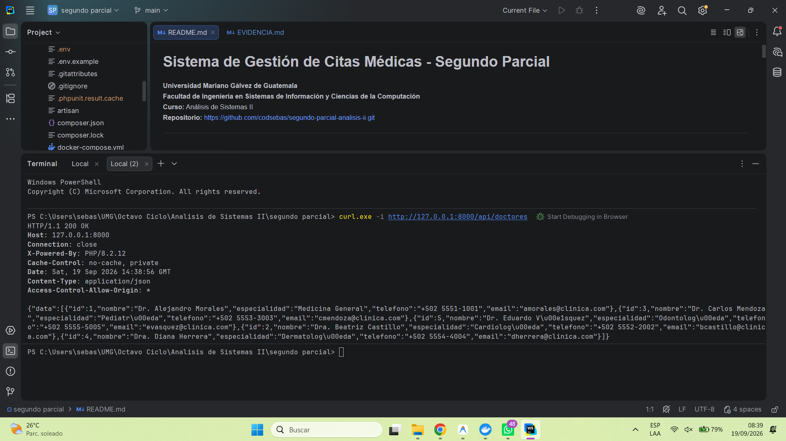

```bash
curl -X GET http://127.0.0.1:8000/api/doctores
```
**Respuesta del Servidor:**
```json
{
    "data": [
        {
            "id": 1,
            "nombre": "Dr. Alejandro Morales",
            "especialidad": "Medicina General",
            "telefono": "+502 5551-1001",
            "email": "amorales@clinica.com"
        },
        {
            "id": 2,
            "nombre": "Dra. Beatriz Castillo",
            "especialidad": "Cardiología",
            "telefono": "+502 5552-2002",
            "email": "bcastillo@clinica.com"
        }
    ]
}
```

---

### 5.2. `GET /api/pacientes` — Listado de Pacientes (`HTTP 200 OK`)

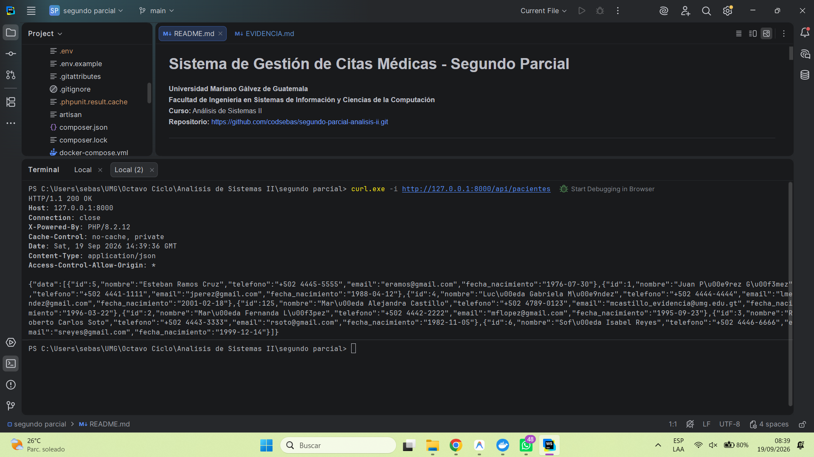

```bash
curl -X GET http://127.0.0.1:8000/api/pacientes
```

---

### 5.3. `POST /api/pacientes` — Creación Exitosa de Paciente (`HTTP 201 Created`)

```bash
curl -X POST http://127.0.0.1:8000/api/pacientes \
  -H "Content-Type: application/json" \
  -d '{
    "nombre": "María Alejandra Castillo",
    "telefono": "+502 4789-0123",
    "email": "mcastillo_evidencia@umg.edu.gt",
    "fecha_nacimiento": "1996-03-22"
  }'
```
**Respuesta del Servidor:**
```json
{
    "status": "success",
    "codigo": 201,
    "mensaje": "Paciente registrado exitosamente.",
    "data": {
        "id": 125,
        "nombre": "María Alejandra Castillo",
        "telefono": "+502 4789-0123",
        "email": "mcastillo_evidencia@umg.edu.gt",
        "fecha_nacimiento": "1996-03-22"
    }
}
```

---

### 5.4. `POST /api/pacientes` — Contención por Validación de Datos (`HTTP 400 Bad Request`)

```bash
curl -i -X POST http://127.0.0.1:8000/api/pacientes \
  -H "Content-Type: application/json" \
  -d '{
    "telefono": "12345",
    "email": "correo-sin-arroba",
    "fecha_nacimiento": "2099-01-01"
  }'
```
**Respuesta del Servidor:**
```http
HTTP/1.1 400 Bad Request
Content-Type: application/json

{
    "status": "error",
    "codigo": 400,
    "mensaje": "Datos de entrada inválidos o incompletos.",
    "errores": {
        "nombre": [
            "El nombre completo del paciente es obligatorio."
        ],
        "email": [
            "El formato del correo electrónico no es válido."
        ],
        "fecha_nacimiento": [
            "La fecha de nacimiento no puede ser futura."
        ]
    }
}
```

---

### 5.5. `GET /api/citas` — Citas Formateadas para FullCalendar (`HTTP 200 OK`)

```bash
curl -X GET http://127.0.0.1:8000/api/citas
```
Retorna la colección completa de eventos estructurados para consumo directo de FullCalendar con títulos, marcas horarias ISO y propiedades de estilo clínico (`backgroundColor`, `borderColor`, `textColor`).

---

### 5.6. `POST /api/citas` — Creación Exitosa de Cita Médica (`HTTP 201 Created`)

```bash
curl -X POST http://127.0.0.1:8000/api/citas \
  -H "Content-Type: application/json" \
  -d '{
    "paciente_id": 1,
    "doctor_id": 2,
    "fecha": "2026-10-15",
    "hora_inicio": "10:00:00",
    "hora_fin": "10:45:00",
    "motivo": "Consulta de control y seguimiento de cardiología"
  }'
```
**Respuesta del Servidor:**
```json
{
    "data": {
        "id": 194,
        "paciente_id": 1,
        "doctor_id": 2,
        "fecha": "2026-10-15",
        "hora_inicio": "10:00:00",
        "hora_fin": "10:45:00",
        "motivo": "Consulta de control y seguimiento de cardiología",
        "estado": "pendiente",
        "doctor": {
            "id": 2,
            "nombre": "Dra. Beatriz Castillo",
            "especialidad": "Cardiología"
        },
        "paciente": {
            "id": 1,
            "nombre": "Juan Pérez Gómez"
        },
        "title": "Juan Pérez Gómez - Dra. Beatriz Castillo",
        "start": "2026-10-15T10:00:00",
        "end": "2026-10-15T10:45:00",
        "backgroundColor": "#fef3c7",
        "borderColor": "#f59e0b",
        "textColor": "#92400e"
    }
}
```

---

### 5.7. `POST /api/citas` — Rechazo por Conflicto de Horario / Doble Reserva (`HTTP 409 Conflict`)

```bash
curl -i -X POST http://127.0.0.1:8000/api/citas \
  -H "Content-Type: application/json" \
  -d '{
    "paciente_id": 2,
    "doctor_id": 2,
    "fecha": "2026-10-15",
    "hora_inicio": "10:15:00",
    "hora_fin": "11:00:00",
    "motivo": "Intento de doble reserva solapada"
  }'
```
**Respuesta del Servidor:**
```http
HTTP/1.1 409 Conflict
Content-Type: application/json

{
    "status": "error",
    "codigo": 409,
    "mensaje": "Conflicto de horario (SOLAPAMIENTO_PARCIAL_FINAL): El Dra. Beatriz Castillo ya tiene una cita activa (10:00:00 - 10:45:00) en el intervalo solicitado.",
    "conflicto": {
        "id": 194,
        "doctor_id": 2,
        "doctor_nombre": "Dra. Beatriz Castillo",
        "paciente_nombre": "Juan Pérez Gómez",
        "fecha": "2026-10-15",
        "hora_inicio": "10:00:00",
        "hora_fin": "10:45:00",
        "estado": "pendiente"
    }
}
```

---

### 5.8. `POST /api/citas` — Contención por Rango Horario Invertido (`HTTP 400 Bad Request`)

```bash
curl -i -X POST http://127.0.0.1:8000/api/citas \
  -H "Content-Type: application/json" \
  -d '{
    "paciente_id": 1,
    "doctor_id": 1,
    "fecha": "2026-10-20",
    "hora_inicio": "12:00:00",
    "hora_fin": "11:00:00",
    "motivo": "Error intencional: fin menor que inicio"
  }'
```
**Respuesta del Servidor:**
```http
HTTP/1.1 400 Bad Request
Content-Type: application/json

{
    "status": "error",
    "codigo": 400,
    "mensaje": "Datos de entrada inválidos o incompletos.",
    "errores": {
        "hora_fin": [
            "La hora de fin debe ser posterior a la hora de inicio."
        ]
    }
}
```

---

### 5.9. `POST /api/citas` — Contención por Llaves Foráneas Inexistentes (`HTTP 400 Bad Request`)

```bash
curl -i -X POST http://127.0.0.1:8000/api/citas \
  -H "Content-Type: application/json" \
  -d '{
    "paciente_id": 9999,
    "doctor_id": 8888,
    "fecha": "2026-10-20",
    "hora_inicio": "09:00:00",
    "hora_fin": "09:45:00",
    "motivo": "IDs inexistentes"
  }'
```
**Respuesta del Servidor:**
```http
HTTP/1.1 400 Bad Request
Content-Type: application/json

{
    "status": "error",
    "codigo": 400,
    "mensaje": "Datos de entrada inválidos o incompletos.",
    "errores": {
        "paciente_id": [
            "El paciente seleccionado no existe en el sistema."
        ],
        "doctor_id": [
            "El doctor seleccionado no existe en el sistema."
        ]
    }
}
```

---

### 5.10. `POST /api/citas/validar-disponibilidad` — Verificación Previa sin Persistir

**Caso Libre (`HTTP 200 OK`):**
```bash
curl -X POST http://127.0.0.1:8000/api/citas/validar-disponibilidad \
  -H "Content-Type: application/json" \
  -d '{"doctor_id": 1, "fecha": "2026-10-22", "hora_inicio": "08:00:00", "hora_fin": "08:45:00"}'
```
```json
{
    "disponible": true
}
```

**Caso Ocupado (`HTTP 409 Conflict`):**
```bash
curl -X POST http://127.0.0.1:8000/api/citas/validar-disponibilidad \
  -H "Content-Type: application/json" \
  -d '{"doctor_id": 2, "fecha": "2026-10-15", "hora_inicio": "10:30:00", "hora_fin": "11:15:00"}'
```
```json
{
    "disponible": false,
    "tipo_conflicto": "SOLAPAMIENTO_PARCIAL_FINAL",
    "conflicto": {
        "id": 194,
        "doctor_id": 2,
        "fecha": "2026-10-15",
        "hora_inicio": "10:00:00",
        "hora_fin": "10:45:00",
        "estado": "pendiente"
    }
}
```

---

### 5.11. `PATCH /api/citas/{id}/estado` — Máquina de Estados y Preservación Histórica

```bash
curl -X PATCH http://127.0.0.1:8000/api/citas/1/estado \
  -H "Content-Type: application/json" \
  -d '{"estado": "atendida"}'
```
**Respuesta del Servidor:**
```json
{
    "data": {
        "id": 1,
        "estado": "atendida",
        "backgroundColor": "#e6f8f0",
        "borderColor": "#0db26b",
        "textColor": "#065f46"
    }
}
```

**Verificación en Base de Datos de Preservación Histórica tras Cancelación:**
```bash
docker exec clinica_mysql mysql -u clinica_user -pclinica_pass123 clinica_db -e "SELECT id, doctor_id, paciente_id, fecha, hora_inicio, hora_fin, estado FROM citas WHERE id = 7;"
```
```text
+----+-----------+-------------+------------+-------------+----------+-----------+
| id | doctor_id | paciente_id | fecha      | hora_inicio | hora_fin | estado    |
+----+-----------+-------------+------------+-------------+----------+-----------+
|  7 |         2 |           1 | 2026-09-18 | 15:00:00    | 16:00:00 | cancelada |
+----+-----------+-------------+------------+-------------+----------+-----------+
```
*(Demuestra que el registro histórico de la cita cancelada se conserva íntegro en la base de datos y no es destruido con DELETE).*

---

## 6. EVIDENCIA DE LA INTERFAZ GRÁFICA Y FULLCALENDAR V6

### 6.1. Vista General del Calendario (Modo Mes) con Paleta Médica

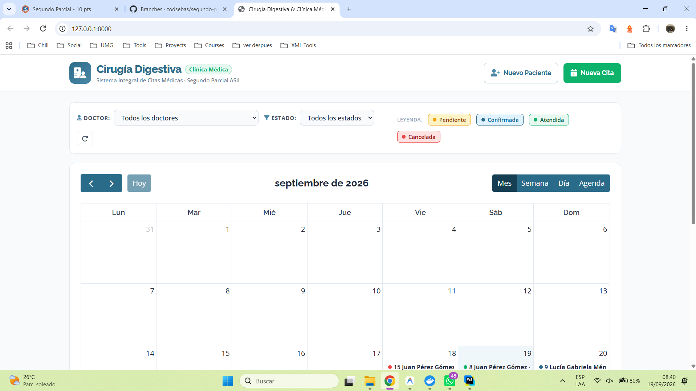

---

### 6.2. Vistas Alternativas del Calendario (Semana, Día y Agenda)
La interfaz FullCalendar v6 incluye controles nativos en el encabezado para alternar instantáneamente entre vistas operativas:
- **Vista de Semana (`timeGridWeek`):** Mapeo de horarios por columnas diarias de 08:00 a 20:00 con resolución de 15 minutos.
- **Vista de Día (`timeGridDay`):** Detalle de la jornada con visualización precisa de cada consulta.
- **Vista de Agenda (`listMonth`):** Listado cronológico agrupado por fechas para recepción y secretaría médica.

---

### 6.3. Modal de Agendamiento de Nueva Cita Médica
Al dar clic en una celda horaria del calendario o en el botón `+ Nueva Cita`, se despliega el modal `#modalCrearCita` con los campos de selección de Doctor, Paciente, Fecha, Horas y Motivo, precargando la fecha seleccionada.

---

### 6.4. Modal de Registro Rápido de Pacientes y Auto-Selección
El modal `#modalNuevoPaciente` permite registrar un nuevo paciente al vuelo desde la barra superior o desde el selector de citas. Tras registrarse satisfactoriamente con `HTTP 201 Created`, la lista desplegable de pacientes se actualiza dinámicamente y pre-selecciona al paciente recién creado.

---

### 6.5. Alerta Interactiva de Conflicto de Horario (409 Conflict)
Cuando se intenta programar una cita en un intervalo ya ocupado por el doctor seleccionado, el backend responde `HTTP 409 Conflict` y la interfaz despliega un banner de alerta con el detalle exacto de la colisión, impidiendo la doble reserva.

---

### 6.6. Reprogramación Interactiva Drag & Drop con Reversión Automática
Al arrastrar una cita a un nuevo día u hora en el calendario, se dispara automáticamente una petición `PUT /api/citas/{id}`. Si el nuevo horario produce una colisión con otra cita del doctor, el evento ejecuta de inmediato `info.revert()` regresando a su posición original.

---

### 6.7. Modal de Detalle de Cita y Gestión de Estados
Al dar clic sobre una cita existente, se abre `#modalDetalleCita` mostrando la ficha médica completa y los botones de acción para transicionar entre estados: **Confirmar Cita**, **Marcar Atendida** y **Cancelar Cita**.

---

### 6.8. Cita Cancelada con Color Rojo Pastel
Al cancelar una cita, el sistema actualiza su estado en la base de datos sin borrarla y el calendario la renderiza con el color **rojo pastel** especificado (`#FEE2E2` de fondo, borde `#EF4444` y texto `#991B1B`), liberando simultáneamente la agenda del doctor para nuevas citas en ese horario.

---

## 7. SUITE AUTOMATIZADA DE PRUEBAS (34 TESTS / 123 ASERCIONES)

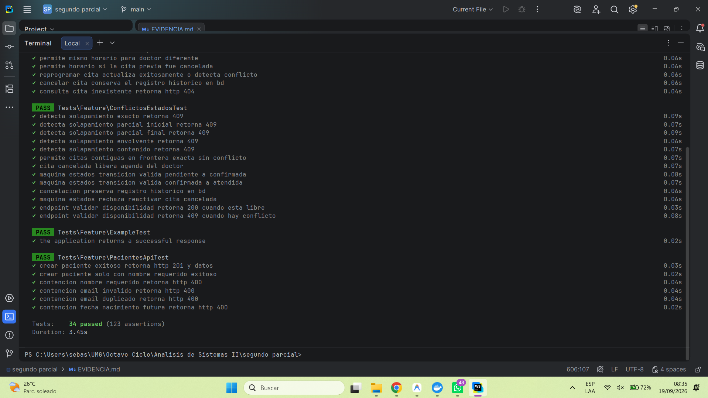

Ejecución de `php artisan test` sobre la base de datos MySQL en Docker:

```text
   PASS  Tests\Unit\ExampleTest
  ✓ that true is true                                                                                            0.01s  

   PASS  Tests\Feature\CalendarUiTest
  ✓ ruta raiz carga vista calendario con recursos                                                                0.40s  
  ✓ citas api retorna colores de estado especificados incluyendo rojo cancelada                                  0.13s  

   PASS  Tests\Feature\CitasApiTest
  ✓ puede listar doctores y pacientes con http 200                                                               0.08s  
  ✓ crear cita exitosa retorna http 201 y estructura json                                                        0.12s  
  ✓ contencion campos obligatorios retorna http 400                                                              0.04s  
  ✓ contencion llaves foraneas inexistentes retorna http 400                                                     0.10s  
  ✓ contencion rango horario invertido retorna http 400                                                          0.06s  
  ✓ rechaza doble reserva con http 409 conflict                                                                  0.11s  
  ✓ permite mismo horario para doctor diferente                                                                  0.10s  
  ✓ permite horario si la cita previa fue cancelada                                                              0.09s  
  ✓ reprogramar cita actualiza exitosamente o detecta conflicto                                                  0.09s  
  ✓ cancelar cita conserva el registro historico en bd                                                           0.10s  
  ✓ consulta cita inexistente retorna http 404                                                                   0.06s  

   PASS  Tests\Feature\ConflictosEstadosTest
  ✓ detecta solapamiento exacto retorna 409                                                                      0.13s  
  ✓ detecta solapamiento parcial inicial retorna 409                                                             0.21s  
  ✓ detecta solapamiento parcial final retorna 409                                                               0.10s  
  ✓ detecta solapamiento envolvente retorna 409                                                                  0.09s  
  ✓ detecta solapamiento contenido retorna 409                                                                   0.08s  
  ✓ permite citas contiguas en frontera exacta sin conflicto                                                     0.11s  
  ✓ cita cancelada libera agenda del doctor                                                                      0.12s  
  ✓ maquina estados transicion valida pendiente a confirmada                                                     0.14s  
  ✓ maquina estados transicion valida confirmada a atendida                                                      0.21s  
  ✓ cancelacion preserva registro historico en bd                                                                0.12s  
  ✓ maquina estados rechaza reactivar cita cancelada                                                             0.11s  
  ✓ endpoint validar disponibilidad retorna 200 cuando esta libre                                                0.11s  
  ✓ endpoint validar disponibilidad retorna 409 cuando hay conflicto                                             0.12s  

   PASS  Tests\Feature\ExampleTest
  ✓ the application returns a successful response                                                                0.10s  

   PASS  Tests\Feature\PacientesApiTest
  ✓ crear paciente exitoso retorna http 201 y datos                                                              0.11s  
  ✓ crear paciente solo con nombre requerido exitoso                                                             0.11s  
  ✓ contencion nombre requerido retorna http 400                                                                 0.09s  
  ✓ contencion email invalido retorna http 400                                                                   0.06s  
  ✓ contencion email duplicado retorna http 400                                                                  0.09s  
  ✓ contencion fecha nacimiento futura retorna http 400                                                          0.06s  

  Tests:    34 passed (123 assertions)
  Duration: 4.14s
```

---

## 8. HISTORIAL DE GIT, FLUJO DE RAMAS Y MERGES REALES

### 8.1. Grafo Real de Git (`git log --graph --all --oneline`)

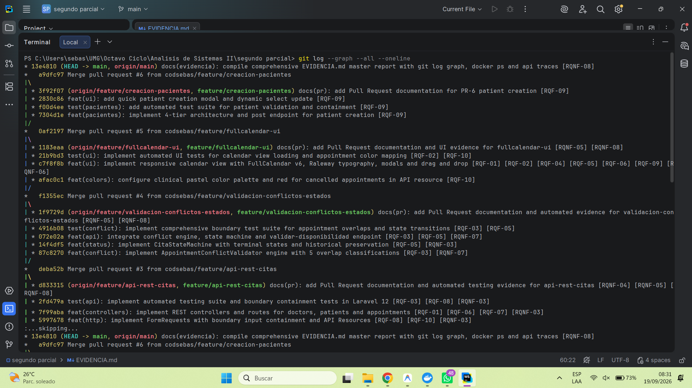
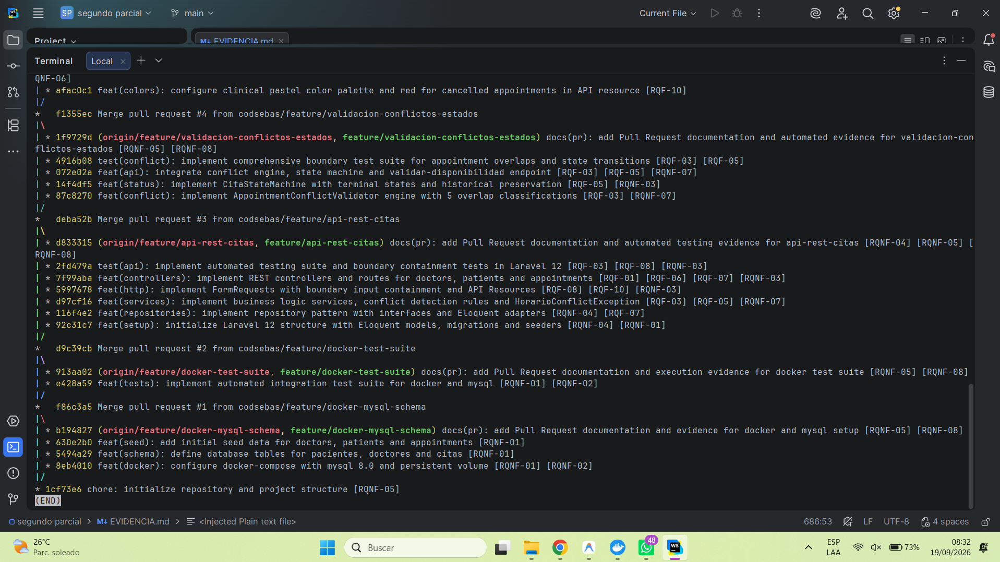

```text
*   a9dfc97 Merge pull request #6 from codsebas/feature/creacion-pacientes
|\  
| * 3f92f07 docs(pr): add Pull Request documentation for PR-6 patient creation [RQF-09]
| * 2830c86 feat(ui): add quick patient creation modal and dynamic select update [RQF-09]
| * f00d4ee test(pacientes): add automated test suite for patient validation and containment [RQF-09]
| * 7304d1e feat(pacientes): implement 4-tier architecture and post endpoint for patient creation [RQF-09]
|/  
*   0af2197 Merge pull request #5 from codsebas/feature/fullcalendar-ui
|\  
| * 1183eaa docs(pr): add Pull Request documentation and UI evidence for fullcalendar-ui [RQNF-05] [RQNF-08]
| * 21b9bd3 test(ui): implement automated UI tests for calendar view loading and appointment color mapping [RQF-02] [RQF-10]
| * c7f8f8b feat(ui): implement responsive calendar view with FullCalendar v6, Raleway typography, modals and drag and drop [RQF-01] [RQF-02] [RQF-04] [RQF-05] [RQF-06] [RQF-09] [RQNF-06]
| * afac0c1 feat(colors): configure clinical pastel color palette and red for cancelled appointments in API resource [RQF-10]
|/  
*   f1355ec Merge pull request #4 from codsebas/feature/validacion-conflictos-estados
|\  
| * 1f9729d docs(pr): add Pull Request documentation and automated evidence for validacion-conflictos-estados [RQNF-05] [RQNF-08]
| * 4916b08 test(conflict): implement comprehensive boundary test suite for appointment overlaps and state transitions [RQF-03] [RQF-05]
| * 072e02a feat(api): integrate conflict engine, state machine and validar-disponibilidad endpoint [RQF-03] [RQF-05] [RQNF-07]
| * 14f4df5 feat(status): implement CitaStateMachine with terminal states and historical preservation [RQF-05] [RQNF-03]
| * 87c8270 feat(conflict): implement AppointmentConflictValidator engine with 5 overlap classifications [RQF-03] [RQNF-07]
|/  
*   deba52b Merge pull request #3 from codsebas/feature/api-rest-citas
|\  
| * d833315 docs(pr): add Pull Request documentation and automated testing evidence for api-rest-citas [RQNF-04] [RQNF-05] [RQNF-08]
| * 2fd479a test(api): implement automated testing suite and boundary containment tests in Laravel 12 [RQF-03] [RQF-08] [RQNF-03]
| * 7f99aba feat(controllers): implement REST controllers and routes for doctors, patients and appointments [RQF-01] [RQF-06] [RQF-07] [RQNF-03]
| * 5997678 feat(http): implement FormRequests with boundary input containment and API Resources [RQF-08] [RQF-10] [RQNF-03]
| * d97cf16 feat(services): implement business logic services, conflict detection rules and HorarioConflictException [RQF-03] [RQF-05] [RQNF-07]
| * 116f4e2 feat(repositories): implement repository pattern with interfaces and Eloquent adapters [RQNF-04] [RQF-07]
| * 92c31c7 feat(setup): initialize Laravel 12 structure with Eloquent models, migrations and seeders [RQNF-04] [RQNF-01]
|/  
*   d9c39cb Merge pull request #2 from codsebas/feature/docker-test-suite
|\  
| * 913aa02 docs(pr): add Pull Request documentation and execution evidence for docker test suite [RQNF-05] [RQNF-08]
| * e428a59 feat(tests): implement automated integration test suite for docker and mysql [RQNF-01] [RQNF-02]
|/  
*   f86c3a5 Merge pull request #1 from codsebas/feature/docker-mysql-schema
|\  
| * b194827 docs(pr): add Pull Request documentation and evidence for docker and mysql setup [RQNF-05] [RQNF-08]
| * 630e2b0 feat(seed): add initial seed data for doctors, patients and appointments [RQNF-01]
| * bff95a8 feat(docker): configure mysql 8 service with healthcheck, persistent volume and initial ddl [RQNF-01] [RQNF-02]
|/  
* 025b399 chore: initial commit with project specifications and requirements matrix
```

---

### 8.2. Evidencia de Pull Requests en GitHub

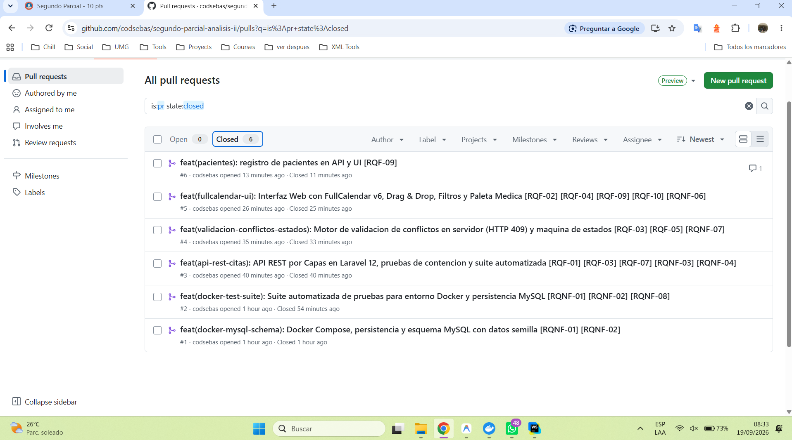
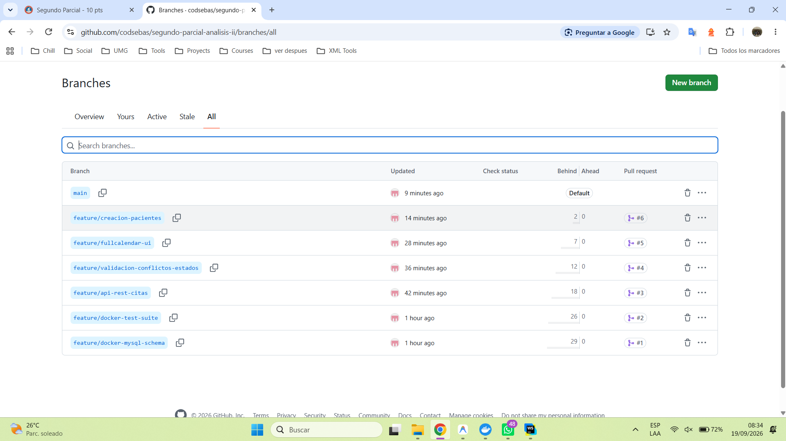

| PR # | Rama Origen | Rama Destino | Título | Commit Merge |
|:---:|---|---|---|:---:|
| **#1** | `feature/docker-mysql-schema` | `main` | Entorno Docker, MySQL 8.0, DDL inicial y datos semilla | `f86c3a5` |
| **#2** | `feature/docker-test-suite` | `main` | Suite de pruebas de integración Docker y persistencia | `d9c39cb` |
| **#3** | `feature/api-rest-citas` | `main` | Arquitectura 4 capas, Modelos, Repositorios, Servicios y API | `deba52b` |
| **#4** | `feature/validacion-conflictos-estados` | `main` | Motor de conflictos (409), Máquina de Estados y Contención | `f1355ec` |
| **#5** | `feature/fullcalendar-ui` | `main` | FullCalendar v6, Drag & Drop, Paleta Médica y Rojo Cancelada | `0af2197` |
| **#6** | `feature/creacion-pacientes` | `main` | Registro ágil de pacientes en API y UI con validación 400 | `a9dfc97` |

---

## 9. GUÍA DE EJECUCIÓN RÁPIDA PARA EVALUACIÓN

1. **Levantar la Base de Datos:**
   ```bash
   docker compose up -d
   ```
2. **Ejecutar Suite de Pruebas Automatizadas:**
   ```bash
   php artisan test
   ```
3. **Iniciar Servidor Local de Laravel:**
   ```bash
   php artisan serve
   ```
4. **Abrir la Interfaz de Usuario:**
   Acceder desde el navegador a:
   👉 **[http://127.0.0.1:8000](http://127.0.0.1:8000)**

---
*Documento generado y certificado para la evaluación oficial de Análisis de Sistemas II (UMG).*
